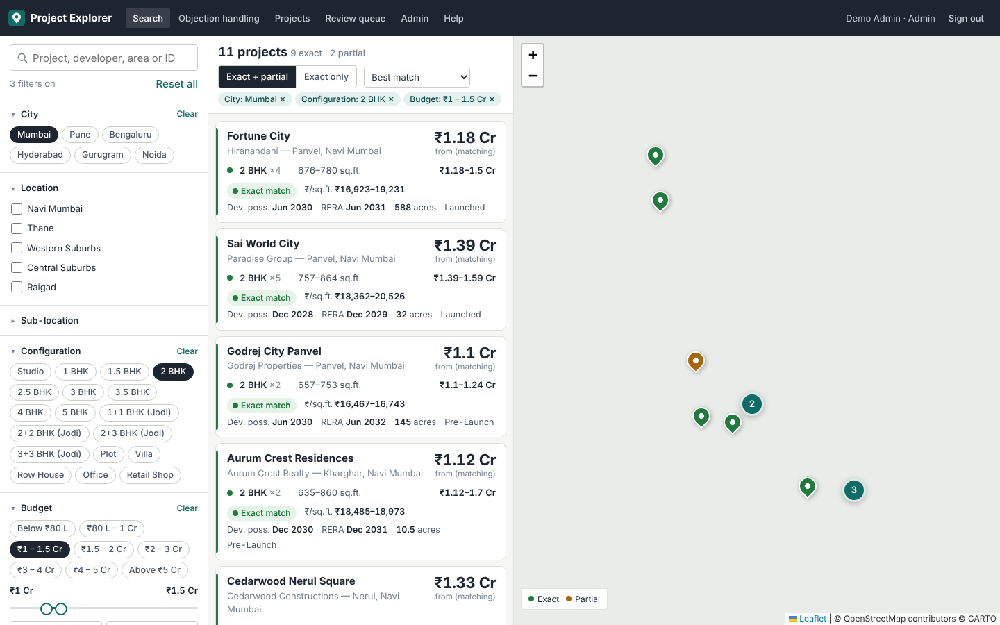
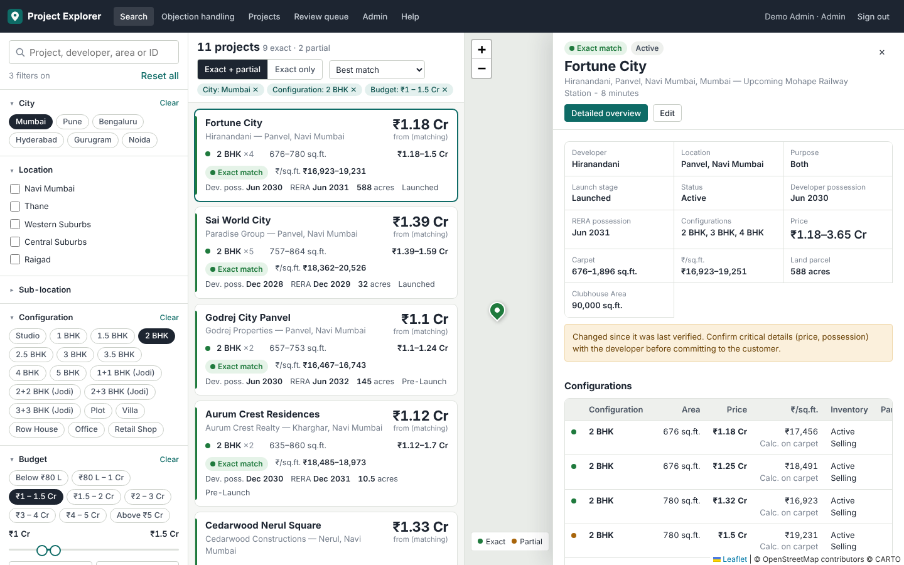
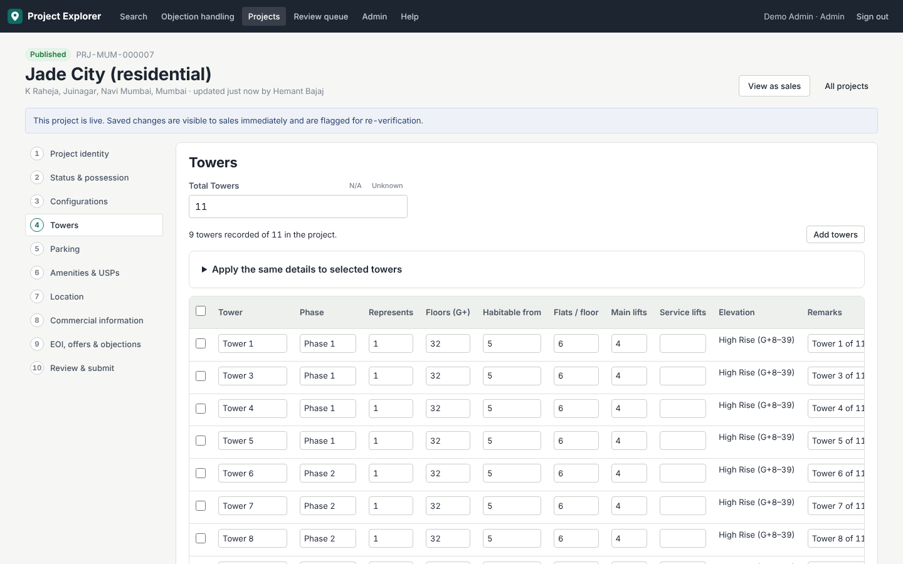
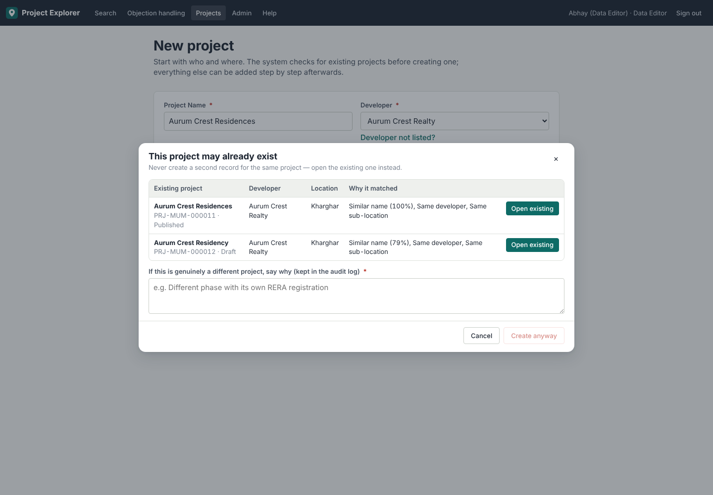
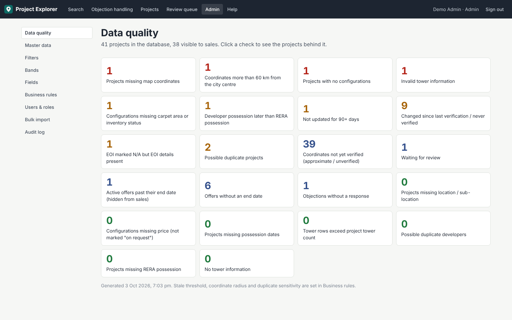
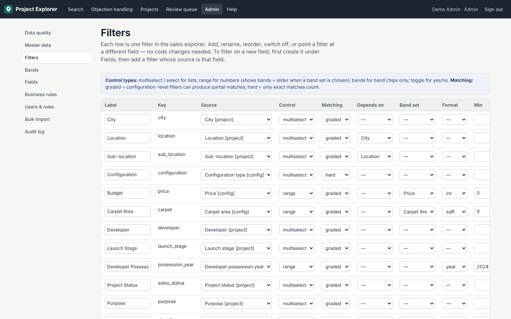

# Project Explorer

A real estate project search engine for live sales calls, with a guided data-entry workflow and an admin layer that lets the business change filters, bands, fields, master data and rules **without a developer**.

It replaces the Excel prototype *5.2 Project Explorer Dashboard – Navi Mumbai.xlsm*. It keeps the prototype's ideas (filters → map → matching configurations → project details) but uses a database-backed architecture. The 9 Navi Mumbai projects from the workbook are migrated into it.

```
Browser (React SPA)  ──HTTPS/JSON──▶  Node.js API (Express)  ──SQL──▶  PostgreSQL 16
   │  Leaflet map + clustering            │  Google ID-token verification
   │  metadata-driven filters & forms     │  matching engine, validation, audit
   └─ map tiles (configurable provider)   └─ serves the built SPA as well
```

## What's in the box

| Area | What you get |
|---|---|
| **Sales explorer** | Filters (all defined in the database), quick bands **and** range sliders, configuration-level matching with Exact / Partial / No match and a reason for each partial, clustered map, compact map card, a detail drawer in the order sales asked for, a Detailed Overview page, an objection-handling library, and shareable search URLs |
| **Data entry** | A 10-step wizard with drafts, duplicate prevention, tri-state fields (Not provided / N/A / No / Unknown), a configurations editor, bulk tower creation with "apply to selected towers" and per-tower overrides, a map pin picker, and live validation (errors / warnings / missing info) |
| **Review workflow** | Draft → Under review → Verified → Published, plus Needs update / Inactive / Archived, with a review trail |
| **Admin** | Master data (geography hierarchy, developers with merge, configuration types, dropdown lists, amenities), filters, bands, fields (including custom fields), business rules, users and roles, data-quality dashboard, audit log, and controlled bulk import (CSV/XLSX) |
| **Safety** | Google sign-in for approved accounts only, role-based permissions, server sessions (deactivating a user signs them out at once), field-level optimistic locking, soft delete, and a full audit trail |

## Screenshots

| | |
|---|---|
|  Search: filters, configuration-level matches, map |  Detail drawer with matched configurations |
|  Data entry: towers with shared details and overrides |  Duplicate prevention |
|  Data-quality dashboard |  Filters defined as data |

## Quick start (local)

Requirements: Node 20+ and PostgreSQL 14+ (16 recommended, with the `pg_trgm` extension, which ships with Postgres).

```bash
createdb explorer
cp .env.example .env            # set DATABASE_URL; leave GOOGLE_CLIENT_ID empty for local testing
npm run install:all
npm run build                   # builds the React client into client/dist
npm run reset-db                # migrate + reference data + 9 workbook projects + 33 sample projects
AUTH_DEV_LOGIN=true DATABASE_URL=postgres://localhost/explorer npm start
# open http://localhost:4000 and pick a demo user (dev sign-in is disabled in production)
```

For live reloading during development, run `npm run dev:api` (API on :4000) and `npm run dev:web` (Vite on :5173, which proxies /api).

### With Docker

```bash
cp .env.example .env            # fill in GOOGLE_CLIENT_ID, ALLOWED_GOOGLE_DOMAIN, BOOTSTRAP_ADMIN_EMAILS
docker compose up -d --build
docker compose exec app npm run seed:production   # reference data + the 9 workbook projects (no fictional samples)
```

## Deploying

The app is one Node process plus one PostgreSQL database. Any host that runs a Node 20 container or process and offers PostgreSQL works. Examples: Render (Web Service + Postgres), Railway, Fly.io, or a small VPS with `docker compose`. Typical shared cPanel hosting is **not** a good fit, because it rarely offers PostgreSQL and long-running Node processes.

1. **Google sign-in.** In Google Cloud Console → APIs & Services → Credentials, create an *OAuth client ID* of type *Web application*. Add your site URL (e.g. `https://explorer.propertypistol.com`) to *Authorised JavaScript origins*. Put the client ID in `GOOGLE_CLIENT_ID`.
2. Set `DATABASE_URL`, `ALLOWED_GOOGLE_DOMAIN=propertypistol.com`, `BOOTSTRAP_ADMIN_EMAILS=<your email>`, `NODE_ENV=production` and `COOKIE_SECURE=true`. Serve over HTTPS.
3. Start the app. Migrations run automatically at start-up (`MIGRATE_ON_START=true`).
4. Run `npm --prefix server run seed:production` once on the empty database.
5. Sign in with the bootstrap admin account, approve other users in **Admin → Users & roles**, then remove `BOOTSTRAP_ADMIN_EMAILS`.
6. **Map tiles.** The default tile layer is CARTO/OpenStreetMap. For production traffic, use a keyed provider (MapTiler, Mapbox, or Google via a tile proxy) and set its URL in **Admin → Business rules → Map provider**. No redeploy is needed.

## Repository layout

```
server/
  src/app.js, index.js            Express app + entry point
  src/services/search.js          matching engine (configuration-level, graded)
  src/services/filterSources.js   whitelist of filterable sources (+ custom fields)
  src/services/records.js         audited writes with field-level locking
  src/services/registry.js        editable columns per entity (single source of truth)
  src/services/projects.js        detail read model, validation, workflow, duplicates
  src/routes/*.js                 auth, explorer, projects, admin, import
  db/migrations/001_schema.sql    database schema
  db/seed/                        reference data, workbook migration, sample data
  test/                           API + unit tests (node:test + supertest)
client/
  src/pages/Explorer.jsx          sales screen
  src/pages/manage/Wizard.jsx     data-entry wizard
  src/pages/admin/*               admin screens
  src/components/*                filters, map, detail, form kit, editors
docs/                             architecture, workbook mapping, guides, validation, testing
```

## Tests

```bash
createdb explorer_test
TEST_DATABASE_URL=postgres://localhost/explorer_test npm test
```

There are 52 automated tests: 44 API tests against a real database plus unit tests. See [docs/TESTING.md](docs/TESTING.md).

## Documentation

- [docs/DEPLOY.md](docs/DEPLOY.md): step-by-step go-live on **Cloudflare Workers + Neon Postgres** (no terminal)
- [docs/DEPLOY_RENDER.md](docs/DEPLOY_RENDER.md): alternative go-live on Render
- [docs/ARCHITECTURE.md](docs/ARCHITECTURE.md): workbook analysis, design decisions, schema, matching engine, flexibility model, concurrency, security, error scenarios, roadmap, limitations
- [docs/WORKBOOK_MAPPING.md](docs/WORKBOOK_MAPPING.md): every sheet and column of the Excel prototype and where it went
- [docs/USER_GUIDE.md](docs/USER_GUIDE.md): instructions for sales, data entry, reviewers, admins and configuration
- [docs/VALIDATION_AND_AUDIT.md](docs/VALIDATION_AND_AUDIT.md): every validation rule and how auditing works
- [docs/TESTING.md](docs/TESTING.md): test coverage and results
